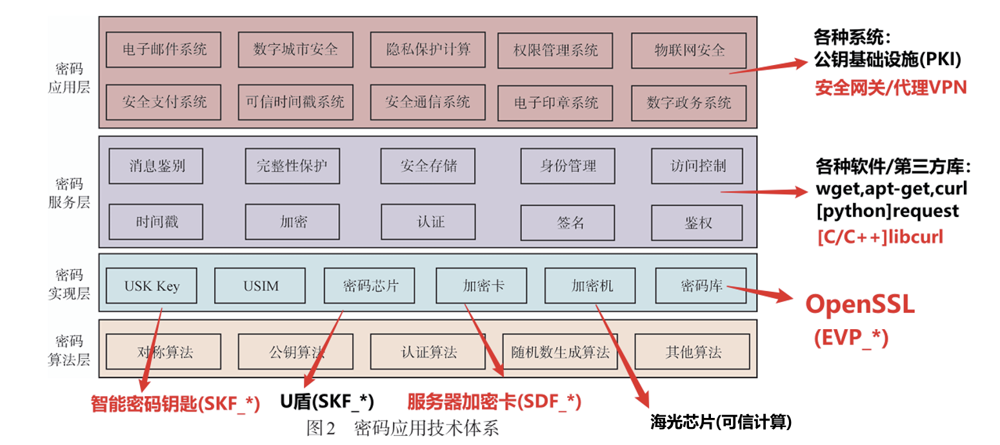
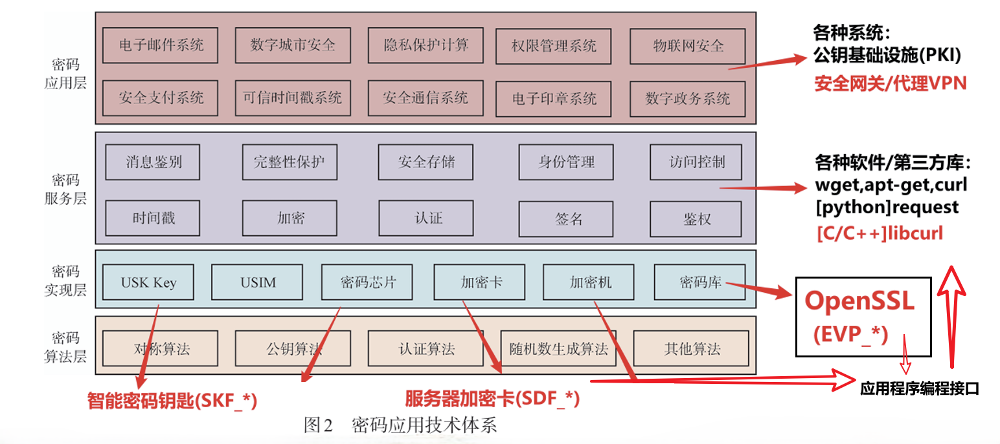
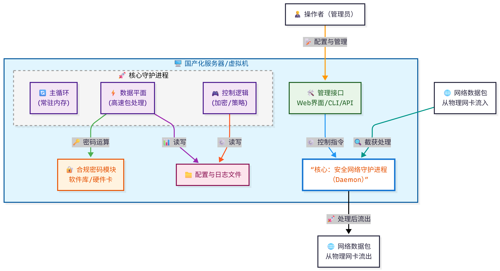
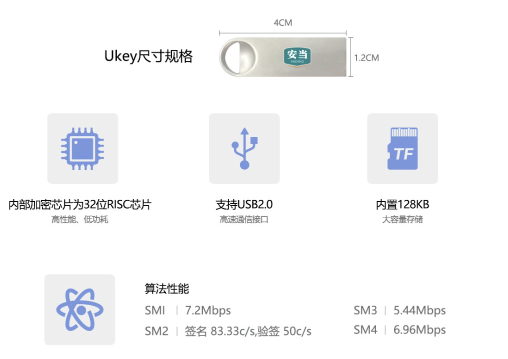
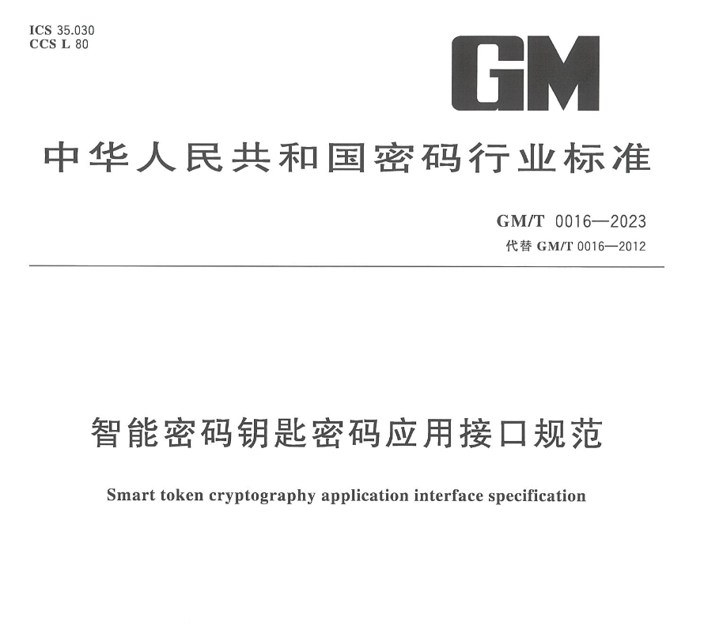
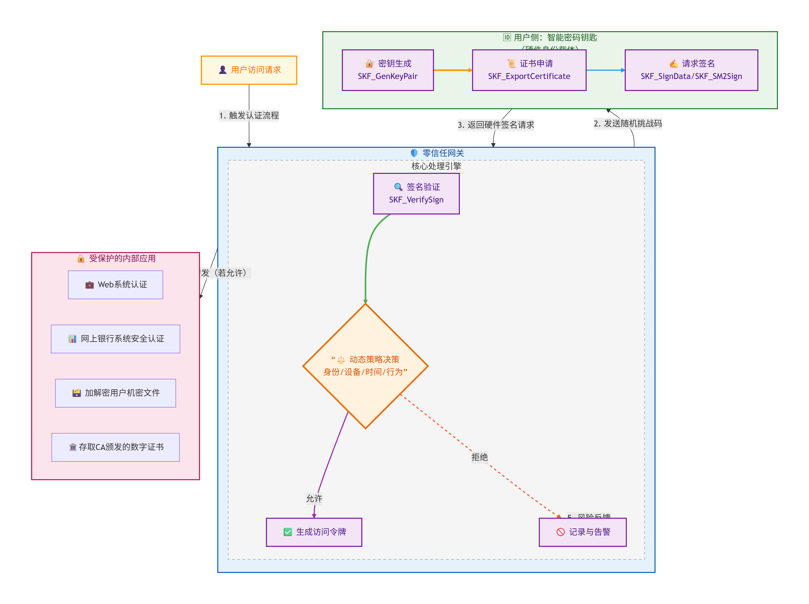
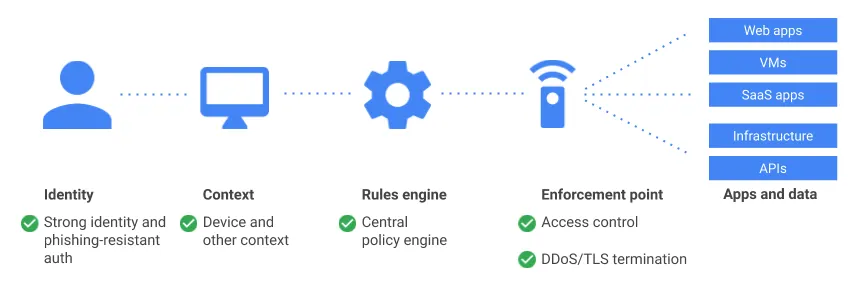

<!-- _class: lead -->

# 信息安全竞赛选题方案讨论

**项目选题方向：** 信息安全应用与防护——国密相关开发

**2026年1月——董海玄**

---

# 国密算法
#### 高安全场合的强制要求：金融、政府、企业、物联网

国密即国家密码局认定的国产密码算法。主要有**SM1，SM2，SM3，SM4**。密钥长度和分组长度均为128位。

- **《信息系统密码应用等级》**
源于国家标准 《GB/T 39786-2021》国家对关键信息基础设施、等保三级及以上的系统、政务信息系统都强制要求定期进行密评。

- **《商用密码产品认证》**
源于密码行业标准《GM/T 0028-2014》。当构建一个等保四级（对应密码应用第四级）的信息系统时，按规定必须采用安全等级达到三级或以上的密码产品。

- **《网络安全法》**
明确要求第三级及以上网络、关键信息基础设施、政务信息系统必须定期开展密评。

<!-- footer: 参考：[新时代国密算法应用研究综述](https://api.artdesignp.com/uploads/file/asp/202509241100470d2835307.pdf) | [国产加密库的商用密码产品认证书示例](https://github.com/Tongsuo-Project/Tongsuo?tab=readme-ov-file)-->

---

<!-- footer: "" -->

## 🆒 密码应用技术体系 

---
## 🆒 密码应用技术体系

---
# 📋 汇报议程

### (应用层)选题一：零信任架构下的“无密码”安全网关
### (服务层)选题二：libcurl的国密插件
### (实现层)选题三：基于OpenSSL 3.0架构的国密provider
### (算法层)可选：FPGA硬件加速 , 形式化验证 , Rust语言重构

——————————————————————————
 **Faster,  Safer, Stronger**

---

# 📋 汇报议程

## (应用层)选题一：零信任架构下的“无密码”办公网关
### (服务层)选题二：libcurl的国密插件
### (实现层)选题三：基于OpenSSL 3.0架构的国密provider
### (算法层)可选：FPGA硬件加速 , 形式化验证 , Rust语言重构

---

# 零信任架构下的“无密码”办公网关
### 基于智能密码钥匙

<!-- footer: 商密二级：[商密认证实施细则](http://www.dxct.net.cn/upload/files/article/20230321/16793962158655117.pdf)
-->

---

## 安全网关：网络守护进程(Daemon)

<!-- footer: 实战案例：[创建并管理自定义守护进程](https://geek-blogs.com/blog/daemons-linux/#7-%E5%AE%9E%E6%88%98%E6%A1%88%E4%BE%8B%E5%88%9B%E5%BB%BA%E5%B9%B6%E7%AE%A1%E7%90%86%E8%87%AA%E5%AE%9A%E4%B9%89%E5%AE%88%E6%8A%A4%E8%BF%9B%E7%A8%8B)-->

---

<!-- footer: "" -->

## 应用程序分类

### 📌 按交互方式
- **命令行应用（CLI）** 
- **桌面应用（GUI）** 
- **Web应用** 

### 📌 按运行方式
- **前台应用** - 主动启动，用户可见
- **后台进程/守护进程** - 持续运行，用户无感

 

###### 安全网关项目：命令行网络服务应用 + 守护进程运行方式

---

## 智能密码钥匙：性能
以国密芯片为基础，完全遵照国家密码管理局颁布的《智能IC卡及智能密码钥匙密码应用接口规范》要求设计的UKEY。

  
  

<!-- footer: 密标委：[**GM/T 0016-2023《智能密码钥匙密码应用接口规范》**](http://www.gmbz.org.cn/main/viewfile/20240628173223234537.html) |  [**GM/T 0017-2023《智能密码钥匙密码应用接口数据格式规范》**](http://www.gmbz.org.cn/main/viewfile/20240628173537912503.html)-->

---

## 智能密码钥匙：安全性
###### 谁真的需要
✅ 政务/事业单位人员：根据2025年《全国政务信息系统密码应用专项检查报告》，**超过87%的省市级单位已强制要求使用国密Ukey进行身份认证。**

✅ 金融与保险从业者：**银行核心系统、保单审批平台普遍要求双因子认证。**

✅ 国企/大型民企IT管理员：统一采购部署时，其硬件级安全特性可降低内部数据泄露风险，提升合规审计通过率。

###### 现代密码学基本原则：“一切秘密寓于密钥之中”
##### 高安全等级芯片基本原则：“私钥永不出设备”

<!-- footer: 密标委：[GM/T 0048-2016 《智能密码钥匙密码检测规范》](http://www.gmbz.org.cn/main/viewfile/20180110030346188143.html)" | [GM/T 0027-2014《智能密码钥匙技术规范》](http://www.gmbz.org.cn/main/viewfile/20180110021741385960.html) -->
 
---
<!-- footer: "" -->
######  系统架构图

---

## 零信任：
###### 不止于网关设备，而是一套安全架构
零信任是一种安全防护架构设计方法，其核心理念是所有交互默认处于不可信状态。以往的安全防护方法基于隐式信任和一次性身份验证。

但是，随着云的广泛应用、对移动应用的日益依赖、AI 的持续发展，以及远程办公的日益普及等趋势，企业组织正逐步摒弃基于边界的传统安全防护方法，转而采用零信任架构。 

BeyondCorp 是 Google 打造的零信任模型。它以 Google 十年的经验为基础，并借鉴了相关社区提出的理念和最佳做法。

通过将访问权限控制措施从网络边界转移至具体的用户，**BeyondCorp 使用户几乎可以在任何地点安全地工作，而不必借助于传统 VPN。**

---

在 2010 年发布的一份 Forrester Research 报告中，John Kindervag 首次提出零信任理念，他指出，网络安全防护的通用做法应更新为“永不信任，始终验证”策略。

传统架构依赖于强大的安全防护边界，一旦攻击者突破这一外部防线，整个架构就会极易受到攻击。**这种“城堡与护城河”模型意味着外部边界之外的用户不受信任，但网络内的所有用户都默认受到信任**。如果用户凭据遭到泄露，这种“默认信任”方法会导致整个环境都极易遭受攻击。

---
# Google：
## [《BeyondCorp: A New Approach to Enterprise Security》](https://www.usenix.org/system/files/login/articles/login_dec14_02_ward.pdf)

> "如今，几乎所有公司都使用防火墙来实施边界安全。然而，这种安全模式存在问题，因为一旦边界被攻破，攻击者便能相对轻松地访问公司的特权内网。随着企业采用移动和云技术，边界的维护正变得越来越困难。谷歌正在采取一种不同的网络安全策略。我们正在取消对特权内网的需求，并将企业应用迁移至互联网。"

谷歌的BeyondCorp计划打造基于“零信任”模型的网络安全基础架构，认证基于受信任的设备和用户而非网络本身。

[**BeyondCorp Design to Deployment at Google**](https://www.usenix.org/system/files/login/articles/login_spring16_06_osborn.pdf)
<!-- footer: 国内零信任安全发展： [华为发布HiSec零信任安全解决方案](https://e.huawei.com/cn/news/ebg/2021/hisec-zero-trust-security-solution) | [2025年中国零信任网络访问行业核心原则、产业链结构及下游应用](https://t.10jqka.com.cn/pid_586228014.shtml) -->

---
<!-- footer: "" -->

# 方案优势

## 📚 可供集成的开源资源与工具

### 网关开发：
使用 Go 语言及其强大的标准库 net/http/httputil 可以快速构建反向代理。Python的FastAPI或Django也可快速搭建。

### 前端演示：
使用 Echarts 或 Ant Design 快速搭建实时监控大屏，视觉效果出色。

---
## 👊具备安全设计优势
### 核心贡献：
用硬件级的智能密码钥匙，完美解决了零信任第一原则——“身份为基石”中最关键、最薄弱的一环（弱口令、钓鱼攻击）。

### 项目逻辑：
你将构建一个网关，强制所有访问请求都必须先通过UKey进行强身份认证，然后经过一个策略引擎进行动态评估，最后授予最小化的访问权限。

### 竞赛亮点：
你不仅仅是在调用几个API，而是在实践并演示一套完整、前沿的安全架构。你可以清晰地对比：传统VPN方案的脆弱性 vs 你的零信任硬件方案的安全性。

---

# 总结：
零信任不是一个具体产品，而是一个安全理念和架构框架。这套方案，是将这一先进理念，通过具体的密码硬件接口（SKF_Login, SKF_SM2Sign等）落地的绝佳案例且应用国密算法，具有实际商业价值与应用意义。

---

# 方案可能面临的困难

---

- **系统开发经验不足**：只做过为数不多的 OJ 题，缺少工程化开发习惯（项目结构、模块化、日志、错误处理），缺乏对编程语言工具的理解。
- **C 语言安全编程能力薄弱**：指针、内存管理、缓冲区溢出防护经验不足，容易出现野指针和栈溢出。
- **应用开发工具，编程工具存在短板**：ssh, git, **makefile, cmake, gcc**, vim, grep, regular expression, CTest, DevOpss……

<!-- footer: 学习路径： [《C和指针》深入理解指针](https://book.douban.com/subject/3012360/) | [《Missing Semester》命令行与工具链](https://missing.csail.mit.edu/) -->

---

- **密码学实现坑位多**：国密接口（SM2/SM3/SM4、SKF_Login、SM2 签名验签）调用流程复杂，参数选择、随机数质量、错误码处理易出错。
- **密码学知识不成体系**：只记得或者已经忘了相关公式及计算。不理解相关机制，不理解安全机制的上下文。
 
<!-- footer: 参考：[密码学基础巩固](https://cmoments.github.io/2025/11/27/Quantum-AI/)-->

---

<!-- footer: "" -->

- **性能与并发优化欠缺**：缺乏对 epoll/kqueue/IOCP、线程池或异步模型的实践，容易出现阻塞或锁竞争导致吞吐不足。

- **网络与协议调试复杂**：网关需要同时处理 TLS、反向代理、策略引擎；证书链、双向认证、会话保持和重放防护都可能成为问题。

<!-- footer: 学习资源：[《Linux高性能服务器编程》- epoll/reactor模式](https://book.douban.com/subject/24722611/) | [OpenSSL命令行调试证书链](https://www.openssl.org/docs/manmaster/man1/openssl-s_client.html) -->

---

<!-- footer: "" -->

- **跨平台/编译环境配置难**:编译链、依赖库(OpenSSL 3.0/provider、国密硬件驱动)和工具链在不同 OS 上差异大,容易踩路径、架构、版本坑。
- **硬件设备调试成本高**:智能密码钥匙驱动、证书/密钥写入、PIN 管理、并发/超时处理需要真实设备验证,远程协作不便。
- **时间与分工压力**:大三课程和竞赛并行,需求不清晰时易导致返工;缺乏项目管理与任务拆分经验。

<!-- footer: 解决方案：[CMake跨平台构建实践](https://cmake.org/cmake/help/latest/guide/tutorial/) | [Docker容器化统一开发环境](https://docs.docker.com/get-started/) | [看板式任务管理(Trello/GitHub Projects)](https://github.com/features/issues) -->

---

<!-- footer: "" -->

# 项目能够带来的收获与乐趣
- **安全工程实战**：从零搭建零信任网关，理解认证、授权、审计的完整链路，而不仅是写“题解”。**(趁热打铁，用安全机制亲手现安全服务)🥰**
- **C 语言硬核成长**：手写网络服务、内存管理、防溢出和错误处理，补齐工程化短板。**（The ability to build everything！）🤩**
- **密码学落地体验**：亲手调用 SM2/SM3/SM4、硬件 UKey 接口，体会“密钥不出设备”的安全边界感。**(亲手将一份标准文件落地)😍**
- **性能调优的成就感**：用线程池/异步 IO/缓存策略把延迟压下去，看 QPS 实时上涨的快乐。对比密码工的程性能评估指标：QOS与传输带宽。**（高端玩家必会）💪**
- **调试与排障快感**：抓包wireshark、日志、gdb、openssl 命令行工具，快速定位协议和证书链问题。**（SM带来的快感😅）**

---
# 目前已有的条件

## 强大的指导老师
## 优秀的成员团队
## [**项目相关资料基础** (download)](http://47.108.189.123/2026/01/21/download-center/Resources.zip)
## [负责人具有相关经验](https://github.com/Tongsuo-Project/Tongsuo/tree/master)

---

<!-- _class: lead -->

# 谢谢！

**欢迎提问与讨论** 💬

**联系方式：2319317080@qq.com / 15528093109**